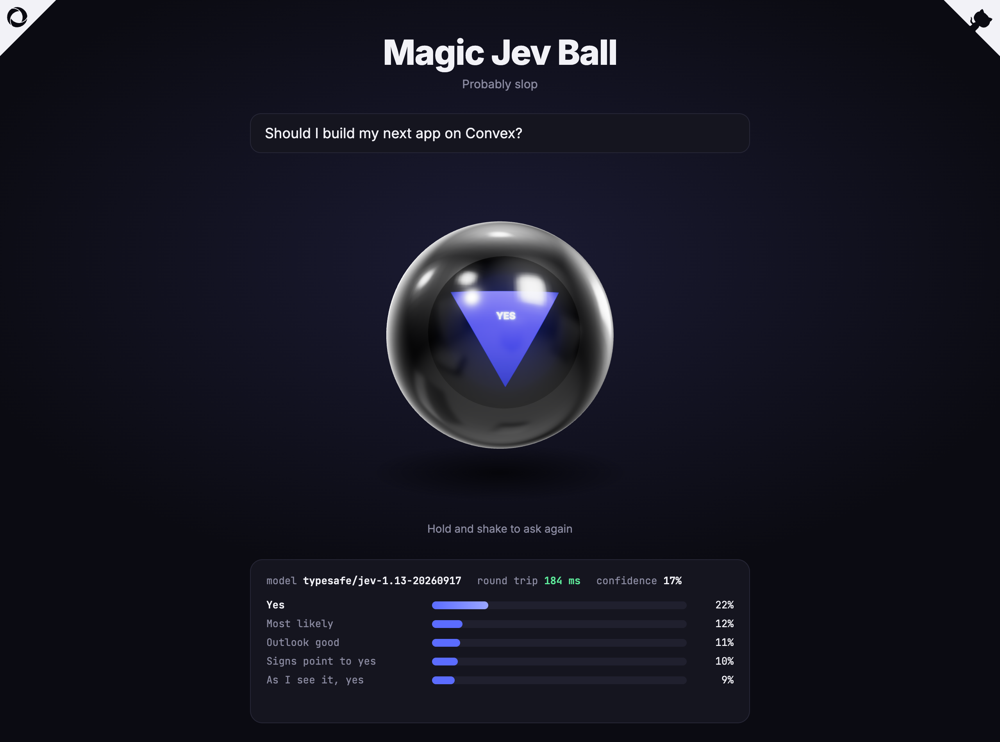

# Magic Jev Ball

[](https://magic-jev.mikecann.app)

A Magic 8 Ball that doesn't pick at random. Hold the ball, shake it, let go, and [Jev](https://docs.typesafe.ai/introduction), TypeSafe's decision model, picks which of the 20 classic answers fits your question. It also returns a probability for every answer, which the page shows under the ball.

Live at [magic-jev.mikecann.app](https://magic-jev.mikecann.app).

## How it works

- `src/main.ts` draws the ball with three.js and handles the hold-shake-release interaction.
- `convex/jev.ts` is one Convex action. It sends your question to Jev through the [Convex AI Gateway](https://docs.convex.dev/ai-gateway/overview), so there are no model API keys to manage.
- The frontend is served by the [Convex static hosting component](https://www.npmjs.com/package/@convex-dev/static-hosting).

## Run it

You need a Convex project on a paid plan, since the AI Gateway is a paid feature.

```bash
npm install
npx convex dev
npm run dev
```

Deploy:

```bash
npx convex deploy -y && npx @convex-dev/static-hosting deploy --skip-convex
```

## License

MIT
